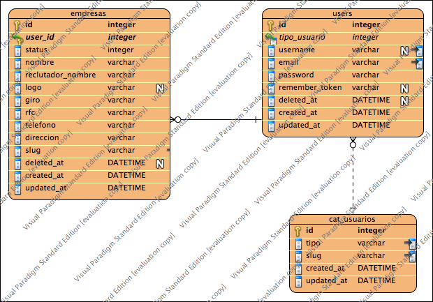
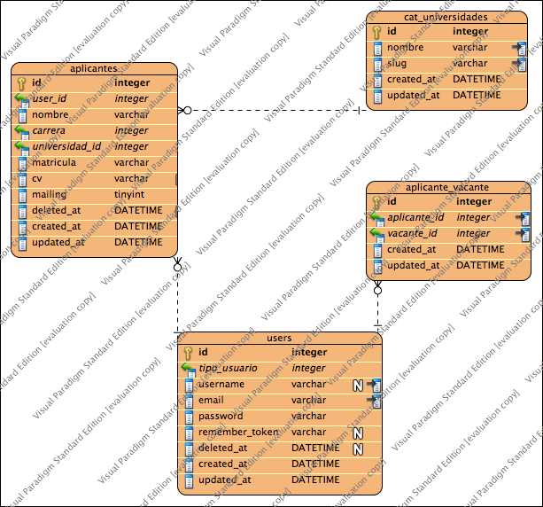
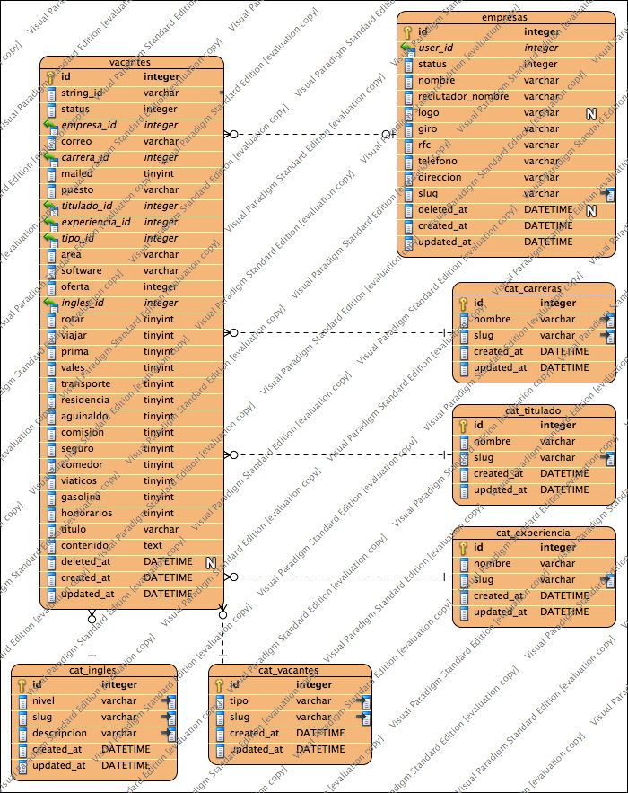
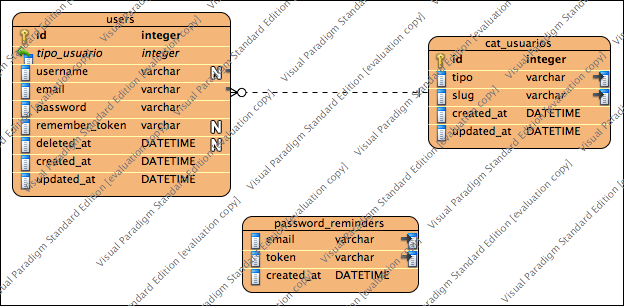
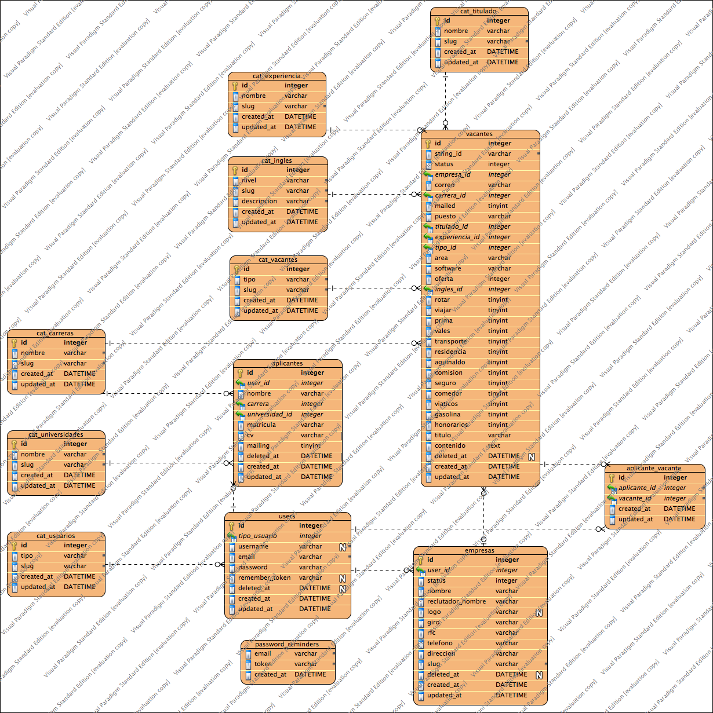
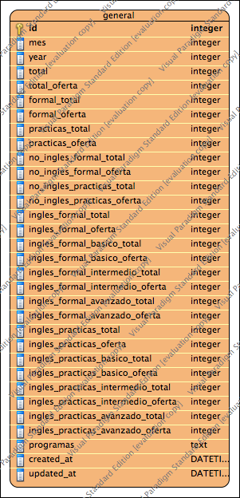

# Diagrama de las BD

* Cada base de datos cuenta con su tabla de migraciones.

* Se implementó SQLITE como base de datos default, ya que no se preveé que sea consumida por más de 100,000 veces al día y no se preveé alamacenar más de 140 terabytes de datos. [+info](http://sqlite.org/whentouse.html)

* Si se necesitará implementar otra base de datos (mysql, postgres or sqlserver), el cambió es únicamente una *cadena* en el archivo de configuración `app/config/database.php` [+info](http://laravel.com/docs/database)

## Empresas

## Aplicante

## Vacantes

## Usuarios

## Vista General del Sistema

# Reportes (de vacantes)

* Existen 10 tablas (más otra para los datos generales) que representan las carreras de la universidad con el mismo modelo

