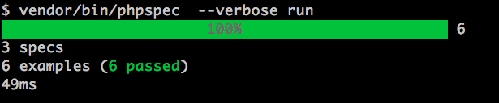

### actualizando columnas en la base de datos
* Crear la migración pertinente a través del sistema
    * `php artisan migrate:make` [+info](http://laravel.com/docs/migrations) 
    
* si se agrega una nueva columna a una tabla:
    * agregar en la propiedad *fillable* (array) del modelo el nombre de la columna creada.
    * **si no se agrega, al actualizar o crear una nueva tupla el dato en la columna aparecerá en blanco y/o arrojará uno exception (QueryExeption)**.

* ### CRONJOBS

Agregar al `crontab`:

`* * * * * /usr/bin/php /vagrant/artisan scheduled:run 1>> /dev/null 2>&1`

Los comandos **CLI** se encuentran en `namespace Bolsa\CLI;`

*DEPENDENCIAS:* [Indatus/dispatcher](https://github.com/Indatus/dispatcher)

`VERSION: ~1.4`

* ### PRESENTADORES

La arquitectura de la aplicación esta desarrollada en base a capas `MODEL-VIEW-PRESENTER`

+ más info [aquí](http://en.wikipedia.org/wiki/Model%E2%80%93view%E2%80%93presenter)

Los presentadores se encuentrar en `Bolsa\Presenters`

*DEPENDENCIAS:* [laracasts/presenter](https://github.com/laracasts/Presenter)

`VERSION: 0.1.*`

* ### SERVICIOS/CORREO

El envio de correos se realiza a través de la clase abstracta `Mailer`
que se encuentra en `namespace Bolsa\Correo`


* ### SERVICIOS/REPORTES

**namespace:** `Bolsa\Reportes`

Se encuentra la clase que maneja el modelo de los *REPORTES*
y las clases que utiliza el **commando:** `$ php artiasan bolsa:actualizar-reporte`

* ### SERVICIOS/VALIDADORES

La validación de formularios se hace a través de la clase abstracta `FormValidator`

*DEPENDENCIAS:* [laracasts/validation](https://github.com/laracasts/Presenter)

`VERSION: ~1.0`

* ### helpers.php

Algunas funciones que apoyan en la capa de presentación **(vistas)** estan dispuestas en este archivo

PATH: `app/Bolsa/helper.php`

* ### clase ObtenerVacantes

Clase usada para crear un *facade* [+info](http://laravel.com/docs/facades) y usarlo como interface
para obtener las vacantes. (muy usada en `ApiController`)

Se puede sustituir por y usar la clase `VacanteModel` (instancia `Eloquent`)
también como se ve en muchos controladores.

* ### directorio "app/commands"

Aquí se almacenan los assets como los pdf's de los currículums.

Si se desea cambiar, sólo hay que modificar el metodo `cv_path()` en el archivo *helpers.php*

* ## Pruebas

SPECS:

Para los spec's se utiliza la dependecia [phpspec](http://www.phpspec.net/)

`VERSION: ~2.0.0`

Para correr los spec's `$ vendor/bin/phpspec  --verbose run`



UNIT TESTS:

Para las pruebas unitarias se utiliza la dependecia [phpunit](https://phpunit.de/)

`VERSION: ~4.0.0`

Para correr las pruebas `$ vendor/bin/phpunit`


PRUEBAS DE ACEPTACION:

Para las pruebas se utiliza la dependecia [codeception](http://codeception.com/)

`VERSION: ~2.0.0`

Para correr las pruebas `$ vendor/bin/codecept run`


## LOC
```
# http://cloc.sourceforge.net
header :
  cloc_url           : http://cloc.sourceforge.net
  cloc_version       : 1.62
  elapsed_seconds    : 0.787210941314697
  n_files            : 223
  n_lines            : 14975
  files_per_second   : 283.278583028298
  lines_per_second   : 19022.8555195012
PHP:
  nFiles: 223
  blank: 2010
  comment: 2797
  code: 10168
SUM:
  blank: 2010
  code: 10168
  comment: 2797
  nFiles: 223
```